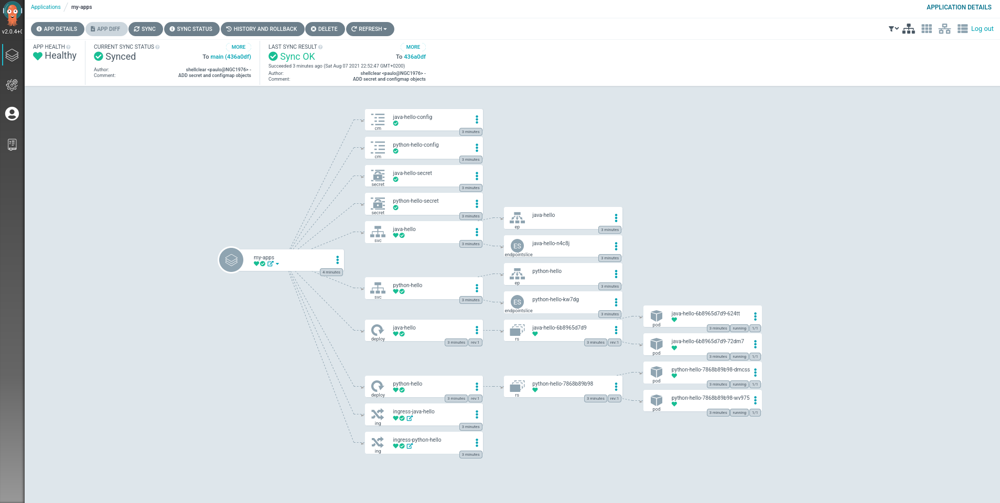

# Helm Repo

This repository stores the Helm charts used to deploy sample applications in Kubernetes.

## Requirements
- Minikube
- Nginx Ingress
- Helm
- ArgoCD

> **NOTE**: _I'm using the GitHub Pages as a Helm repository and you'll find all the instructions to install the packages here -> https://shellclear.github.io/helm/_

